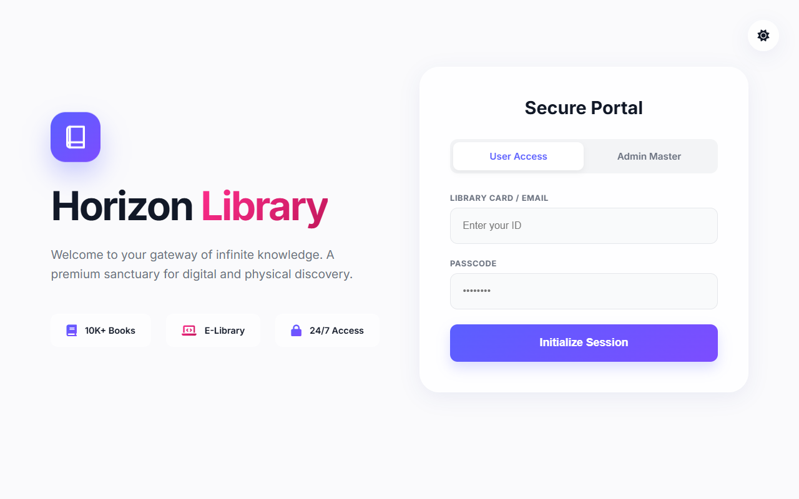
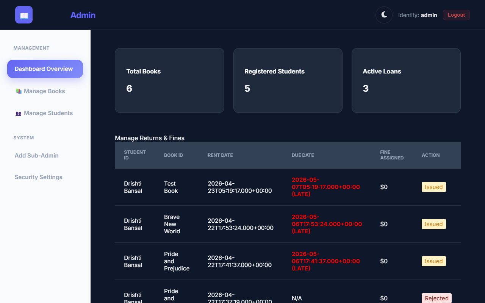
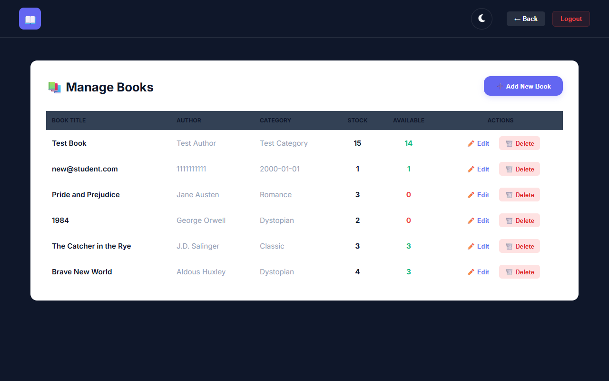
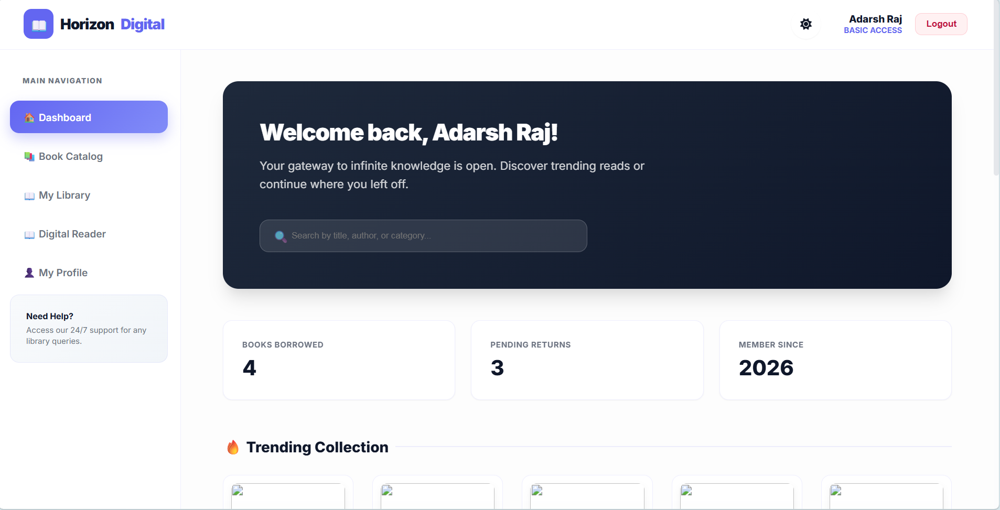

# Library Management System


A **full-stack web application** for managing library operations, built with **Spring Boot 3.2.5**, **MySQL 8.0**, and modern web technologies. This system handles student registration, book catalog management, issue/return tracking, and administrative functions.

## 🚀 Features

- ✅ **Student Management** - Register, view, and manage student profiles
- ✅ **Book Catalog** - Add, update, and search books with cover images
- ✅ **Issue/Return System** - Track book issuance and returns
- ✅ **Fine Calculation** - Automatic fine computation for overdue books
- ✅ **Admin Dashboard** - Comprehensive administrative interface
- ✅ **User Portal** - Student checkout and profile management
- ✅ **REST APIs** - Complete REST API for all operations
- ✅ **Database Persistence** - MySQL with proper normalization
- ✅ **Responsive UI** - Bootstrap-based responsive templates

## 🏗️ Architecture

```
┌─────────────────────────────────────────┐
│         Frontend Layer (Thymeleaf)      │
│    HTML/CSS/JavaScript Templates        │
└────────────────┬────────────────────────┘
                 │
┌────────────────▼────────────────────────┐
│      Controller Layer (REST APIs)       │
│   StudentController, BookController     │
└────────────────┬────────────────────────┘
                 │
┌────────────────▼────────────────────────┐
│      Service Layer (Business Logic)     │
│         LibraryService                  │
└────────────────┬────────────────────────┘
                 │
┌────────────────▼────────────────────────┐
│    Repository Layer (Data Access)       │
│    Spring Data JPA Repositories         │
└────────────────┬────────────────────────┘
                 │
┌────────────────▼────────────────────────┐
│      MySQL Database Layer               │
│   Students, Books, Issues, Admins       │
└─────────────────────────────────────────┘
```

## 🛠️ Technology Stack

| Component | Technology | Version |
|-----------|-----------|---------|
| **Language** | Java | 17 (LTS) |
| **Framework** | Spring Boot | 3.2.5 |
| **Build Tool** | Maven | 3.9.14 |
| **Database** | MySQL | 8.0+ |
| **ORM** | Spring Data JPA | 3.2.5 |
| **Template Engine** | Thymeleaf | 3.1.2 |
| **Frontend** | HTML5/CSS3/JavaScript | - |
| **API Format** | REST/JSON | - |

## 📋 Database Schema

**Tables:**
- `students` - Student information (ID, name, email, phone, registration date)
- `books` - Book catalog (ID, ISBN, title, author, quantity, cover image)
- `issues` - Book issuance tracking (ID, student, book, issue date, return date, fine)
- `admins` - Administrator accounts (ID, username, password)

**Relationships:**
- One Student → Many Issues
- One Book → Many Issues
- One Admin → Manages System

## 🚀 Quick Start

### Prerequisites
- Java 17 or higher
- MySQL 8.0+
- Maven 3.9.14+

### 1. Clone Repository
```bash
git clone https://github.com/adarshraj1242/library-management-system.git
cd library-management-system
```

### 2. Database Setup
```bash
# Run schema
mysql -u root -p < sql/schema.sql

# Or use provided scripts
./setup_mysql.bat              # Windows
./setup_mysql_admin.ps1        # Windows PowerShell
```

### 3. Configure Database
Edit `src/main/resources/application.properties`:
```properties
spring.datasource.username=your_mysql_user
spring.datasource.password=your_mysql_password
```

### 4. Build & Run
```bash
# Build
./mvnw clean package

# Run
./mvnw spring-boot:run
```

### 5. Access Application
- **Web UI**: http://localhost:8080
- **Admin Panel**: http://localhost:8080/admin
- **Student Portal**: http://localhost:8080/student
- **REST APIs**: http://localhost:8080/api/...

## 📚 API Endpoints

### Students
- `GET /api/students` - Get all students
- `POST /api/students` - Add new student
- `GET /api/students/{id}` - Get student by ID
- `PUT /api/students/{id}` - Update student

### Books
- `GET /api/books` - Get all books
- `POST /api/books` - Add new book
- `GET /api/books/search` - Search books
- `GET /api/books/trending` - Get trending books

### Issues
- `POST /api/issues/checkout` - Checkout book
- `POST /api/issues/return` - Return book
- `GET /api/issues/{studentId}` - Get student's issues

## 📁 Project Structure

```
library-management-system/
├── src/
│   ├── main/
│   │   ├── java/com/library/library/
│   │   │   ├── controller/          # REST Controllers
│   │   │   ├── service/             # Business Logic
│   │   │   ├── repository/          # Data Access Layer
│   │   │   ├── model/               # JPA Entities
│   │   │   ├── dto/                 # Data Transfer Objects
│   │   │   ├── exception/           # Exception Handling
│   │   │   ├── config/              # Spring Configuration
│   │   │   └── util/                # Utility Classes
│   │   ├── resources/
│   │   │   ├── templates/           # Thymeleaf Templates
│   │   │   ├── static/              # CSS, JS, Images
│   │   │   ├── application.properties
│   │   │   ├── schema.sql           # Database Schema
│   │   │   └── data.sql             # Sample Data
│   └── test/                        # Unit Tests
├── pom.xml                          # Maven Configuration
├── mvnw/mvnw.cmd                    # Maven Wrapper
├── sql/schema.sql                   # Database Schema
└── README.md                        # This File
```

## 🔐 Security Considerations

> ⚠️ **Production Deployment Requirements:**
- Replace hardcoded credentials with environment variables
- Implement Spring Security for authentication/authorization
- Use BCrypt for password hashing
- Configure HTTPS/SSL certificates
- Implement JWT for API authentication
- Add role-based access control (RBAC)
- Set up proper error handling and logging

## 🧪 Testing

```bash
# Run all tests
./mvnw clean test

# Run specific test class
./mvnw test -Dtest=StudentControllerTest

# Generate coverage report
./mvnw clean verify
```

## 📸 Screenshots

| Feature | Screenshot |
|---------|-----------|
| **Login Page** |  |
| **Admin Dashboard** |  |
| **Book Management** |  |
| **Student Portal** |  |

## 📖 Documentation

- [Quick Start Guide](QUICK_START.md) - 5-minute setup
- [API Documentation](API_DOCUMENTATION.md) - Complete REST API reference
- [Development Guide](DEVELOPMENT.md) - Architecture and workflows
- [Contributing Guidelines](CONTRIBUTING.md) - How to contribute
- [Code Review](CODE_REVIEW.md) - Detailed code quality assessment

## 🤝 Contributing

Contributions are welcome! Please read [CONTRIBUTING.md](CONTRIBUTING.md) for details on our code of conduct and the process for submitting pull requests.

## 📄 License

This project is licensed under the MIT License - see the [LICENSE](LICENSE) file for details.

## 👨‍💻 Author

**Adarsh Raj**
- GitHub: [@adarshraj1242](https://github.com/adarshraj1242)
- Email: adarshraj@github.com

## 🆘 Support

For issues, questions, or suggestions, please [open an issue](https://github.com/adarshraj1242/library-management-system/issues) on GitHub.

## 📚 Learning Resources

- [Spring Boot Documentation](https://spring.io/projects/spring-boot)
- [Spring Data JPA](https://spring.io/projects/spring-data-jpa)
- [MySQL Documentation](https://dev.mysql.com/doc/)
- [Thymeleaf Guide](https://www.thymeleaf.org/doc/tutorials/3.1/usingthymeleaf.html)

---

**Last Updated**: June 2026  
**Version**: 1.0.0  
**Status**: ✅ Active Development

Thank you for using Library Management System! ⭐
